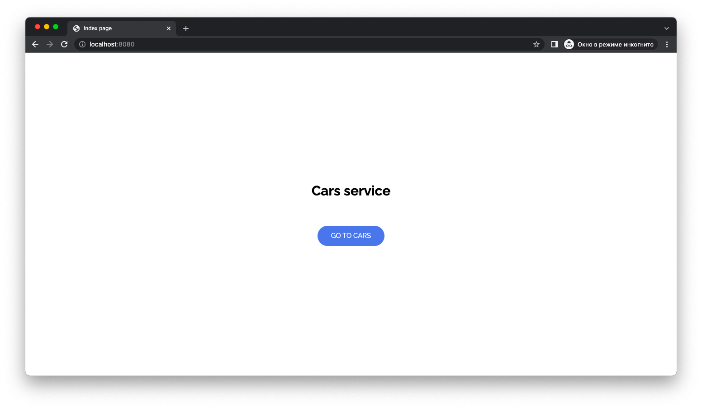
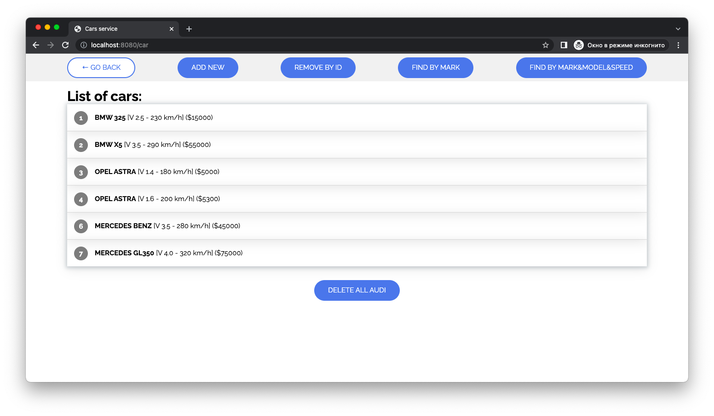

# Spring Data

Cоздайте пустую базу данных автомобилей используя Spring Data.
В автомобиле должны быть такие данные: марка, модель, объем двигателя, цена, макс. скорость).
Выполните следующие запросы:
1) вывести все машины
2) добавление машины
3) поиск машины по марке
4) поиск машины по марке, модели и максимальной скорости
5) удаление машины по `id`
6) удаление всех машин `Audi`